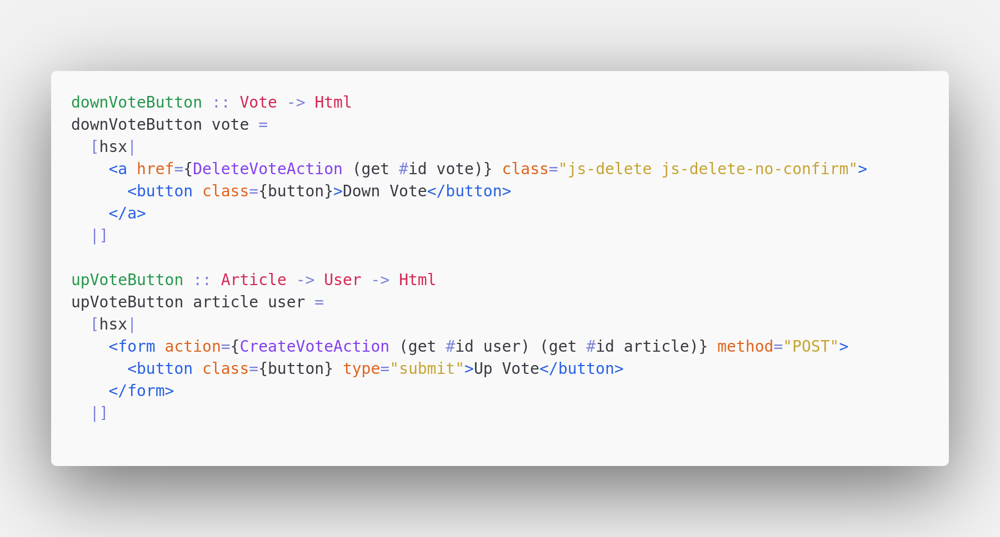

# vscode-hsx

VS Code Syntax Highlighting For Haskell HSX QuasiQuotes



## Enabling [Emmet](https://emmet.io/) Inside HSX Blocks

Add to your settings:

```json
  "emmet.includeLanguages": {
    "haskell": "html"
  }
```
